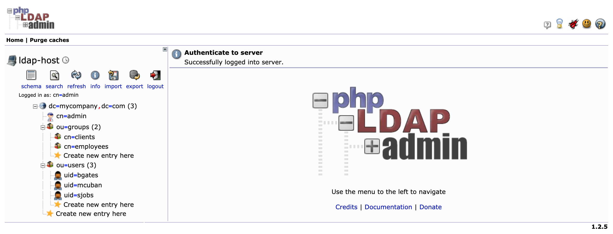

# springboot-ldap-testcontainers

The goal of this project is to create a simple [`Spring Boot`](https://docs.spring.io/spring-boot/docs/current/reference/htmlsingle/) REST API, called `simple-service`, and secure it with `Spring Security LDAP` module. We will use [`Testcontainers`](https://www.testcontainers.org/) for integration testing. 

## Application

- ### simple-service

  `Spring Boot` Java Web application that exposes two endpoints:
   - `GET /api/public`: that can be access by anyone, it is not secured;
   - `GET /api/private`: that can just be accessed by users authenticated with valid LDAP credentials.

## Prerequisites

- [`Java 11+`]( https://www.oracle.com/java/technologies/downloads/#java11)
- [`Docker`](https://www.docker.com/)
- [`Docker-Compose`](https://docs.docker.com/compose/install/)

## Start Environment

Open a terminal and inside `springboot-ldap-testcontainers` root folder run
```
docker-compose up -d
```

## Import OpenLDAP Users

The `LDIF` file we will use, `simple-service/src/main/resources/ldap-mycompany-com.ldif`, contains a pre-defined structure for `mycompany.com`. Basically, it has 2 groups (`employees` and `clients`) and 3 users (`Bill Gates`, `Steve Jobs` and `Mark Cuban`). Besides, it's defined that `Bill Gates` and `Steve Jobs` belong to `employees` group and `Mark Cuban` belongs to `clients` group.
```
Bill Gates > username: bgates, password: 123
Steve Jobs > username: sjobs, password: 123
Mark Cuban > username: mcuban, password: 123
```

There are two ways to import those users: by running a script; or by using `phpldapadmin`

### Import users running a script

- In a terminal, make use you are in `springboot-ldap-testcontainers` root folder

- Run the following script
  ```
  ./import-openldap-users.sh
  ```
  
- Check users imported using [`ldapsearch`](https://linux.die.net/man/1/ldapsearch)
  ```
  ldapsearch -x -D "cn=admin,dc=mycompany,dc=com" \
    -w admin -H ldap://localhost:389 \
    -b "ou=users,dc=mycompany,dc=com" \
    -s sub "(uid=*)"
  ```

### Import users using phpldapadmin

- Access https://localhost:6443

- Login with the following credentials
  ```
  Login DN: cn=admin,dc=mycompany,dc=com
  Password: admin
  ```

- Import the file `simple-service/src/main/resources/ldap-mycompany-com.ldif`

- You should see something like

  

## Run application with Maven

- In a terminal, make use you are in `springboot-ldap-testcontainers` root folder

- Run the following command to start `simple-service`
  ```
  ./mvnw clean spring-boot:run --projects simple-service
  ```

## Run application as Docker container

- In a terminal, make sure you are in `springboot-ldap-testcontainers` root folder

- Build Docker Image
  - JVM
    ```
    ./docker-build.sh
    ```
  - Native
    ```
    ./docker-build.sh native
    ```

- Environment Variables

  | Environment Variable | Description                                             |
  |----------------------|---------------------------------------------------------|
  | `LDAP_HOST`          | Specify host of the `LDAP` to use (default `localhost`) |
  | `LDAP_PORT`          | Specify port of the `LDAP` to use (default `389`)       |

- Run Docker Container
  ```
  docker run --rm --name simple-service -p 8080:8080 \
    -e LDAP_HOST=openldap \
    --network springboot-ldap-testcontainers_default \
    ivanfranchin/simple-service:1.0.0
  ```

## Testing using curl

1. Open a terminal

1. Call the endpoint `/api/public`
   ```
   curl -i localhost:8080/api/public
   ```

   It should return
   ```
   HTTP/1.1 200
   It is public.
   ```

1. Try to call the endpoint `/api/private` without credentials
   ``` 
   curl -i localhost:8080/api/private
   ```
   
   It should return
   ```
   HTTP/1.1 401
   { "timestamp": "...", "status": 401, "error": "Unauthorized", "message": "Unauthorized", "path": "/api/private" }
   ```

1. Call the endpoint `/api/private` again. This time informing `username` and `password`
   ``` 
   curl -i -u bgates:123 localhost:8080/api/private
   ```
   
   It should return
   ```
   HTTP/1.1 200
   bgates, it is private.
   ```

1. Call the endpoint `/api/private` informing an invalid password
   ``` 
   curl -i -u bgates:124 localhost:8080/api/private
   ```
   
   It should return
   ```
   HTTP/1.1 401 
   ```

1. Call the endpoint `/api/private` informing a non-existing user
   ``` 
   curl -i -u cslim:123 localhost:8080/api/private
   ```
   
   It should return
   ```
   HTTP/1.1 401
   ```

## Testing using Swagger

1. Access http://localhost:8080/swagger-ui.html

   

1. Click `GET /api/public` to open it; then, click `Try it out` button and, finally, `Execute` button.

   It should return
   ```
   Code: 200
   Response Body: It is public.
   ```

1. Click `Authorize` button (green-white one, located at top-right of the page)

1. In the form that opens, provide the `Bill Gates` credentials, i.e, username `bgates` and password `123`. Then, click `Authorize` button, and to finalize, click `Close` button

1. Click `GET /api/private` to open it; then click `Try it out` button and, finally, `Execute` button.

   It should return
   ```
   Code: 200
   Response Body: bgates, it is private.
   ```

## Shutdown

- To stop `simple-service` application, go to the terminal where it is running and press `Ctrl+C`
- To stop and remove docker-compose containers, network and volumes, in a terminal and inside `springboot-ldap-testcontainers` root folder, run the following command
  ```
  docker-compose down -v
  ```

## Running Test Cases

- In a terminal, make sure you are inside `springboot-ldap-testcontainers` root folder

- Run the command below to start the **Unit Tests**
  ```
  ./mvnw clean test --projects simple-service
  ```

- Run the command below to start the **Unit** and **Integration Tests**
  > **Note:** `Testcontainers` will start automatically `OpenLDAP` Docker container before some tests begin and will shut it down when the tests finish.

  > **Warning:** it's not working, see [Issues](#issues)

  ```
  ./mvnw clean verify --projects simple-service
  ```

## Cleanup

To remove the Docker image created by this project, go to a terminal and, inside `springboot-ldap-testcontainers` root folder, run the following script
```
./remove-docker-images.sh
```

## Issues

When running Maven `verify`, the following exception is thrown during integration test
```
ERROR 50216 --- [           main] o.s.boot.SpringApplication               : Application run failed

java.lang.IllegalArgumentException: No auto configuration classes found in META-INF/spring.factories. If you are using a custom packaging, make sure that file is correct.
	at org.springframework.util.Assert.notEmpty(Assert.java:470) ~[spring-core-5.3.14.jar:5.3.14]
	at org.springframework.boot.autoconfigure.AutoConfigurationImportSelector.getCandidateConfigurations(AutoConfigurationImportSelector.java:180) ~[spring-boot-autoconfigure-2.6.2.jar:2.6.2]
	at org.springframework.boot.autoconfigure.AutoConfigurationImportSelector.getAutoConfigurationEntry(AutoConfigurationImportSelector.java:123) ~[spring-boot-autoconfigure-2.6.2.jar:2.6.2]
	at org.springframework.boot.autoconfigure.AutoConfigurationImportSelector$AutoConfigurationGroup.process(AutoConfigurationImportSelector.java:434) ~[spring-boot-autoconfigure-2.6.2.jar:2.6.2]
	at org.springframework.context.annotation.ConfigurationClassParser$DeferredImportSelectorGrouping.getImports(ConfigurationClassParser.java:879) ~[spring-context-5.3.14.jar:5.3.14]
	at org.springframework.context.annotation.ConfigurationClassParser$DeferredImportSelectorGroupingHandler.processGroupImports(ConfigurationClassParser.java:809) ~[spring-context-5.3.14.jar:5.3.14]
	at org.springframework.context.annotation.ConfigurationClassParser$DeferredImportSelectorHandler.process(ConfigurationClassParser.java:780) ~[spring-context-5.3.14.jar:5.3.14]
	at org.springframework.context.annotation.ConfigurationClassParser.parse(ConfigurationClassParser.java:193) ~[spring-context-5.3.14.jar:5.3.14]
	at org.springframework.context.annotation.ConfigurationClassPostProcessor.processConfigBeanDefinitions(ConfigurationClassPostProcessor.java:331) ~[spring-context-5.3.14.jar:5.3.14]
	at org.springframework.context.annotation.ConfigurationClassPostProcessor.postProcessBeanDefinitionRegistry(ConfigurationClassPostProcessor.java:247) ~[spring-context-5.3.14.jar:5.3.14]
	at org.springframework.context.support.PostProcessorRegistrationDelegate.invokeBeanDefinitionRegistryPostProcessors(PostProcessorRegistrationDelegate.java:311) ~[spring-context-5.3.14.jar:5.3.14]
	at org.springframework.context.support.PostProcessorRegistrationDelegate.invokeBeanFactoryPostProcessors(PostProcessorRegistrationDelegate.java:112) ~[spring-context-5.3.14.jar:5.3.14]
	at org.springframework.context.support.AbstractApplicationContext.invokeBeanFactoryPostProcessors(AbstractApplicationContext.java:746) ~[spring-context-5.3.14.jar:5.3.14]
	at org.springframework.context.support.AbstractApplicationContext.refresh(AbstractApplicationContext.java:564) ~[spring-context-5.3.14.jar:5.3.14]
	at org.springframework.boot.web.servlet.context.ServletWebServerApplicationContext.refresh(ServletWebServerApplicationContext.java:145) ~[spring-boot-2.6.2.jar:2.6.2]
	at org.springframework.boot.SpringApplication.refresh(SpringApplication.java:730) ~[test-classes/:2.6.2]
	at org.springframework.boot.SpringApplication.refreshContext(SpringApplication.java:412) ~[test-classes/:2.6.2]
	at org.springframework.boot.SpringApplication.run(SpringApplication.java:302) ~[test-classes/:2.6.2]
	at org.springframework.boot.test.context.SpringBootContextLoader.loadContext(SpringBootContextLoader.java:121) ~[spring-boot-test-2.6.2.jar:2.6.2]
	at org.springframework.test.context.cache.DefaultCacheAwareContextLoaderDelegate.loadContextInternal(DefaultCacheAwareContextLoaderDelegate.java:99) ~[spring-test-5.3.14.jar:5.3.14]
	at org.springframework.aot.test.AotCacheAwareContextLoaderDelegate.loadContextInternal(AotCacheAwareContextLoaderDelegate.java:62) ~[spring-native-0.11.1.jar:0.11.1]
	at org.springframework.test.context.cache.DefaultCacheAwareContextLoaderDelegate.loadContext(DefaultCacheAwareContextLoaderDelegate.java:124) ~[spring-test-5.3.14.jar:5.3.14]
	at org.springframework.aot.test.AotCacheAwareContextLoaderDelegate.loadContext(AotCacheAwareContextLoaderDelegate.java:72) ~[spring-native-0.11.1.jar:0.11.1]
	at org.springframework.test.context.support.DefaultTestContext.getApplicationContext(DefaultTestContext.java:124) ~[spring-test-5.3.14.jar:5.3.14]
	at org.springframework.test.context.support.DependencyInjectionTestExecutionListener.injectDependencies(DependencyInjectionTestExecutionListener.java:118) ~[spring-test-5.3.14.jar:5.3.14]
	at org.springframework.test.context.support.DependencyInjectionTestExecutionListener.prepareTestInstance(DependencyInjectionTestExecutionListener.java:83) ~[spring-test-5.3.14.jar:5.3.14]
	at org.springframework.aot.test.AotDependencyInjectionTestExecutionListener.prepareTestInstance(AotDependencyInjectionTestExecutionListener.java:61) ~[spring-native-0.11.1.jar:0.11.1]
	at org.springframework.test.context.TestContextManager.prepareTestInstance(TestContextManager.java:248) ~[spring-test-5.3.14.jar:5.3.14]
	at org.springframework.test.context.junit.jupiter.SpringExtension.postProcessTestInstance(SpringExtension.java:138) ~[spring-test-5.3.14.jar:5.3.14]
	at org.junit.jupiter.engine.descriptor.ClassBasedTestDescriptor.lambda$invokeTestInstancePostProcessors$8(ClassBasedTestDescriptor.java:363) ~[junit-jupiter-engine-5.8.2.jar:5.8.2]
	at org.junit.jupiter.engine.descriptor.ClassBasedTestDescriptor.executeAndMaskThrowable(ClassBasedTestDescriptor.java:368) ~[junit-jupiter-engine-5.8.2.jar:5.8.2]
	at org.junit.jupiter.engine.descriptor.ClassBasedTestDescriptor.lambda$invokeTestInstancePostProcessors$9(ClassBasedTestDescriptor.java:363) ~[junit-jupiter-engine-5.8.2.jar:5.8.2]
	at java.base/java.util.stream.ReferencePipeline$3$1.accept(ReferencePipeline.java:195) ~[na:na]
	at java.base/java.util.stream.ReferencePipeline$2$1.accept(ReferencePipeline.java:177) ~[na:na]
	at java.base/java.util.ArrayList$ArrayListSpliterator.forEachRemaining(ArrayList.java:1655) ~[na:na]
	at java.base/java.util.stream.AbstractPipeline.copyInto(AbstractPipeline.java:484) ~[na:na]
	at java.base/java.util.stream.AbstractPipeline.wrapAndCopyInto(AbstractPipeline.java:474) ~[na:na]
	at java.base/java.util.stream.StreamSpliterators$WrappingSpliterator.forEachRemaining(StreamSpliterators.java:312) ~[na:na]
	at java.base/java.util.stream.Streams$ConcatSpliterator.forEachRemaining(Streams.java:735) ~[na:na]
	at java.base/java.util.stream.Streams$ConcatSpliterator.forEachRemaining(Streams.java:734) ~[na:na]
	at java.base/java.util.stream.ReferencePipeline$Head.forEach(ReferencePipeline.java:658) ~[na:na]
	at org.junit.jupiter.engine.descriptor.ClassBasedTestDescriptor.invokeTestInstancePostProcessors(ClassBasedTestDescriptor.java:362) ~[junit-jupiter-engine-5.8.2.jar:5.8.2]
	at org.junit.jupiter.engine.descriptor.ClassBasedTestDescriptor.lambda$instantiateAndPostProcessTestInstance$6(ClassBasedTestDescriptor.java:283) ~[junit-jupiter-engine-5.8.2.jar:5.8.2]
	at org.junit.platform.engine.support.hierarchical.ThrowableCollector.execute(ThrowableCollector.java:73) ~[junit-platform-engine-1.8.2.jar:1.8.2]
	at org.junit.jupiter.engine.descriptor.ClassBasedTestDescriptor.instantiateAndPostProcessTestInstance(ClassBasedTestDescriptor.java:282) ~[junit-jupiter-engine-5.8.2.jar:5.8.2]
	at org.junit.jupiter.engine.descriptor.ClassBasedTestDescriptor.lambda$testInstancesProvider$4(ClassBasedTestDescriptor.java:272) ~[junit-jupiter-engine-5.8.2.jar:5.8.2]
	at java.base/java.util.Optional.orElseGet(Optional.java:369) ~[na:na]
	at org.junit.jupiter.engine.descriptor.ClassBasedTestDescriptor.lambda$testInstancesProvider$5(ClassBasedTestDescriptor.java:271) ~[junit-jupiter-engine-5.8.2.jar:5.8.2]
	at org.junit.jupiter.engine.execution.TestInstancesProvider.getTestInstances(TestInstancesProvider.java:31) ~[junit-jupiter-engine-5.8.2.jar:5.8.2]
	at org.junit.jupiter.engine.descriptor.TestMethodTestDescriptor.lambda$prepare$0(TestMethodTestDescriptor.java:102) ~[junit-jupiter-engine-5.8.2.jar:5.8.2]
	at org.junit.platform.engine.support.hierarchical.ThrowableCollector.execute(ThrowableCollector.java:73) ~[junit-platform-engine-1.8.2.jar:1.8.2]
	at org.junit.jupiter.engine.descriptor.TestMethodTestDescriptor.prepare(TestMethodTestDescriptor.java:101) ~[junit-jupiter-engine-5.8.2.jar:5.8.2]
	at org.junit.jupiter.engine.descriptor.TestMethodTestDescriptor.prepare(TestMethodTestDescriptor.java:66) ~[junit-jupiter-engine-5.8.2.jar:5.8.2]
	at org.junit.platform.engine.support.hierarchical.NodeTestTask.lambda$prepare$2(NodeTestTask.java:123) ~[junit-platform-engine-1.8.2.jar:1.8.2]
	at org.junit.platform.engine.support.hierarchical.ThrowableCollector.execute(ThrowableCollector.java:73) ~[junit-platform-engine-1.8.2.jar:1.8.2]
	at org.junit.platform.engine.support.hierarchical.NodeTestTask.prepare(NodeTestTask.java:123) ~[junit-platform-engine-1.8.2.jar:1.8.2]
	at org.junit.platform.engine.support.hierarchical.NodeTestTask.execute(NodeTestTask.java:90) ~[junit-platform-engine-1.8.2.jar:1.8.2]
	at java.base/java.util.ArrayList.forEach(ArrayList.java:1541) ~[na:na]
	at org.junit.platform.engine.support.hierarchical.SameThreadHierarchicalTestExecutorService.invokeAll(SameThreadHierarchicalTestExecutorService.java:41) ~[junit-platform-engine-1.8.2.jar:1.8.2]
	at org.junit.platform.engine.support.hierarchical.NodeTestTask.lambda$executeRecursively$6(NodeTestTask.java:155) ~[junit-platform-engine-1.8.2.jar:1.8.2]
	at org.junit.platform.engine.support.hierarchical.ThrowableCollector.execute(ThrowableCollector.java:73) ~[junit-platform-engine-1.8.2.jar:1.8.2]
	at org.junit.platform.engine.support.hierarchical.NodeTestTask.lambda$executeRecursively$8(NodeTestTask.java:141) ~[junit-platform-engine-1.8.2.jar:1.8.2]
	at org.junit.platform.engine.support.hierarchical.Node.around(Node.java:137) ~[junit-platform-engine-1.8.2.jar:1.8.2]
	at org.junit.platform.engine.support.hierarchical.NodeTestTask.lambda$executeRecursively$9(NodeTestTask.java:139) ~[junit-platform-engine-1.8.2.jar:1.8.2]
	at org.junit.platform.engine.support.hierarchical.ThrowableCollector.execute(ThrowableCollector.java:73) ~[junit-platform-engine-1.8.2.jar:1.8.2]
	at org.junit.platform.engine.support.hierarchical.NodeTestTask.executeRecursively(NodeTestTask.java:138) ~[junit-platform-engine-1.8.2.jar:1.8.2]
	at org.junit.platform.engine.support.hierarchical.NodeTestTask.execute(NodeTestTask.java:95) ~[junit-platform-engine-1.8.2.jar:1.8.2]
	at java.base/java.util.ArrayList.forEach(ArrayList.java:1541) ~[na:na]
	at org.junit.platform.engine.support.hierarchical.SameThreadHierarchicalTestExecutorService.invokeAll(SameThreadHierarchicalTestExecutorService.java:41) ~[junit-platform-engine-1.8.2.jar:1.8.2]
	at org.junit.platform.engine.support.hierarchical.NodeTestTask.lambda$executeRecursively$6(NodeTestTask.java:155) ~[junit-platform-engine-1.8.2.jar:1.8.2]
	at org.junit.platform.engine.support.hierarchical.ThrowableCollector.execute(ThrowableCollector.java:73) ~[junit-platform-engine-1.8.2.jar:1.8.2]
	at org.junit.platform.engine.support.hierarchical.NodeTestTask.lambda$executeRecursively$8(NodeTestTask.java:141) ~[junit-platform-engine-1.8.2.jar:1.8.2]
	at org.junit.platform.engine.support.hierarchical.Node.around(Node.java:137) ~[junit-platform-engine-1.8.2.jar:1.8.2]
	at org.junit.platform.engine.support.hierarchical.NodeTestTask.lambda$executeRecursively$9(NodeTestTask.java:139) ~[junit-platform-engine-1.8.2.jar:1.8.2]
	at org.junit.platform.engine.support.hierarchical.ThrowableCollector.execute(ThrowableCollector.java:73) ~[junit-platform-engine-1.8.2.jar:1.8.2]
	at org.junit.platform.engine.support.hierarchical.NodeTestTask.executeRecursively(NodeTestTask.java:138) ~[junit-platform-engine-1.8.2.jar:1.8.2]
	at org.junit.platform.engine.support.hierarchical.NodeTestTask.execute(NodeTestTask.java:95) ~[junit-platform-engine-1.8.2.jar:1.8.2]
	at org.junit.platform.engine.support.hierarchical.SameThreadHierarchicalTestExecutorService.submit(SameThreadHierarchicalTestExecutorService.java:35) ~[junit-platform-engine-1.8.2.jar:1.8.2]
	at org.junit.platform.engine.support.hierarchical.HierarchicalTestExecutor.execute(HierarchicalTestExecutor.java:57) ~[junit-platform-engine-1.8.2.jar:1.8.2]
	at org.junit.platform.engine.support.hierarchical.HierarchicalTestEngine.execute(HierarchicalTestEngine.java:54) ~[junit-platform-engine-1.8.2.jar:1.8.2]
	at org.junit.platform.launcher.core.DefaultLauncher.execute(DefaultLauncher.java:220) ~[junit-platform-launcher-1.3.1.jar:1.3.1]
	at org.junit.platform.launcher.core.DefaultLauncher.lambda$execute$6(DefaultLauncher.java:188) ~[junit-platform-launcher-1.3.1.jar:1.3.1]
	at org.junit.platform.launcher.core.DefaultLauncher.withInterceptedStreams(DefaultLauncher.java:202) ~[junit-platform-launcher-1.3.1.jar:1.3.1]
	at org.junit.platform.launcher.core.DefaultLauncher.execute(DefaultLauncher.java:181) ~[junit-platform-launcher-1.3.1.jar:1.3.1]
	at org.junit.platform.launcher.core.DefaultLauncher.execute(DefaultLauncher.java:128) ~[junit-platform-launcher-1.3.1.jar:1.3.1]
	at org.apache.maven.surefire.junitplatform.JUnitPlatformProvider.invokeAllTests(JUnitPlatformProvider.java:150) ~[surefire-junit-platform-2.22.2.jar:2.22.2]
	at org.apache.maven.surefire.junitplatform.JUnitPlatformProvider.invoke(JUnitPlatformProvider.java:124) ~[surefire-junit-platform-2.22.2.jar:2.22.2]
	at org.apache.maven.surefire.booter.ForkedBooter.invokeProviderInSameClassLoader(ForkedBooter.java:384) ~[surefire-booter-2.22.2.jar:2.22.2]
	at org.apache.maven.surefire.booter.ForkedBooter.runSuitesInProcess(ForkedBooter.java:345) ~[surefire-booter-2.22.2.jar:2.22.2]
	at org.apache.maven.surefire.booter.ForkedBooter.execute(ForkedBooter.java:126) ~[surefire-booter-2.22.2.jar:2.22.2]
	at org.apache.maven.surefire.booter.ForkedBooter.main(ForkedBooter.java:418) ~[surefire-booter-2.22.2.jar:2.22.2]

ERROR 50216 --- [           main] o.s.test.context.TestContextManager      : Caught exception while allowing TestExecutionListener [org.springframework.aot.test.AotDependencyInjectionTestExecutionListener@1e54cb33] to prepare test instance [com.mycompany.simpleservice.SimpleServiceApplicationIT@35835e65]

java.lang.IllegalStateException: Failed to load ApplicationContext
	at org.springframework.test.context.cache.DefaultCacheAwareContextLoaderDelegate.loadContext(DefaultCacheAwareContextLoaderDelegate.java:132) ~[spring-test-5.3.14.jar:5.3.14]
	at org.springframework.aot.test.AotCacheAwareContextLoaderDelegate.loadContext(AotCacheAwareContextLoaderDelegate.java:72) ~[spring-native-0.11.1.jar:0.11.1]
	at org.springframework.test.context.support.DefaultTestContext.getApplicationContext(DefaultTestContext.java:124) ~[spring-test-5.3.14.jar:5.3.14]
	at org.springframework.test.context.support.DependencyInjectionTestExecutionListener.injectDependencies(DependencyInjectionTestExecutionListener.java:118) ~[spring-test-5.3.14.jar:5.3.14]
	at org.springframework.test.context.support.DependencyInjectionTestExecutionListener.prepareTestInstance(DependencyInjectionTestExecutionListener.java:83) ~[spring-test-5.3.14.jar:5.3.14]
	at org.springframework.aot.test.AotDependencyInjectionTestExecutionListener.prepareTestInstance(AotDependencyInjectionTestExecutionListener.java:61) ~[spring-native-0.11.1.jar:0.11.1]
	at org.springframework.test.context.TestContextManager.prepareTestInstance(TestContextManager.java:248) ~[spring-test-5.3.14.jar:5.3.14]
	at org.springframework.test.context.junit.jupiter.SpringExtension.postProcessTestInstance(SpringExtension.java:138) ~[spring-test-5.3.14.jar:5.3.14]
	at org.junit.jupiter.engine.descriptor.ClassBasedTestDescriptor.lambda$invokeTestInstancePostProcessors$8(ClassBasedTestDescriptor.java:363) ~[junit-jupiter-engine-5.8.2.jar:5.8.2]
	at org.junit.jupiter.engine.descriptor.ClassBasedTestDescriptor.executeAndMaskThrowable(ClassBasedTestDescriptor.java:368) ~[junit-jupiter-engine-5.8.2.jar:5.8.2]
	at org.junit.jupiter.engine.descriptor.ClassBasedTestDescriptor.lambda$invokeTestInstancePostProcessors$9(ClassBasedTestDescriptor.java:363) ~[junit-jupiter-engine-5.8.2.jar:5.8.2]
	at java.base/java.util.stream.ReferencePipeline$3$1.accept(ReferencePipeline.java:195) ~[na:na]
	at java.base/java.util.stream.ReferencePipeline$2$1.accept(ReferencePipeline.java:177) ~[na:na]
	at java.base/java.util.ArrayList$ArrayListSpliterator.forEachRemaining(ArrayList.java:1655) ~[na:na]
	at java.base/java.util.stream.AbstractPipeline.copyInto(AbstractPipeline.java:484) ~[na:na]
	at java.base/java.util.stream.AbstractPipeline.wrapAndCopyInto(AbstractPipeline.java:474) ~[na:na]
	at java.base/java.util.stream.StreamSpliterators$WrappingSpliterator.forEachRemaining(StreamSpliterators.java:312) ~[na:na]
	at java.base/java.util.stream.Streams$ConcatSpliterator.forEachRemaining(Streams.java:735) ~[na:na]
	at java.base/java.util.stream.Streams$ConcatSpliterator.forEachRemaining(Streams.java:734) ~[na:na]
	at java.base/java.util.stream.ReferencePipeline$Head.forEach(ReferencePipeline.java:658) ~[na:na]
	at org.junit.jupiter.engine.descriptor.ClassBasedTestDescriptor.invokeTestInstancePostProcessors(ClassBasedTestDescriptor.java:362) ~[junit-jupiter-engine-5.8.2.jar:5.8.2]
	at org.junit.jupiter.engine.descriptor.ClassBasedTestDescriptor.lambda$instantiateAndPostProcessTestInstance$6(ClassBasedTestDescriptor.java:283) ~[junit-jupiter-engine-5.8.2.jar:5.8.2]
	at org.junit.platform.engine.support.hierarchical.ThrowableCollector.execute(ThrowableCollector.java:73) ~[junit-platform-engine-1.8.2.jar:1.8.2]
	at org.junit.jupiter.engine.descriptor.ClassBasedTestDescriptor.instantiateAndPostProcessTestInstance(ClassBasedTestDescriptor.java:282) ~[junit-jupiter-engine-5.8.2.jar:5.8.2]
	at org.junit.jupiter.engine.descriptor.ClassBasedTestDescriptor.lambda$testInstancesProvider$4(ClassBasedTestDescriptor.java:272) ~[junit-jupiter-engine-5.8.2.jar:5.8.2]
	at java.base/java.util.Optional.orElseGet(Optional.java:369) ~[na:na]
	at org.junit.jupiter.engine.descriptor.ClassBasedTestDescriptor.lambda$testInstancesProvider$5(ClassBasedTestDescriptor.java:271) ~[junit-jupiter-engine-5.8.2.jar:5.8.2]
	at org.junit.jupiter.engine.execution.TestInstancesProvider.getTestInstances(TestInstancesProvider.java:31) ~[junit-jupiter-engine-5.8.2.jar:5.8.2]
	at org.junit.jupiter.engine.descriptor.TestMethodTestDescriptor.lambda$prepare$0(TestMethodTestDescriptor.java:102) ~[junit-jupiter-engine-5.8.2.jar:5.8.2]
	at org.junit.platform.engine.support.hierarchical.ThrowableCollector.execute(ThrowableCollector.java:73) ~[junit-platform-engine-1.8.2.jar:1.8.2]
	at org.junit.jupiter.engine.descriptor.TestMethodTestDescriptor.prepare(TestMethodTestDescriptor.java:101) ~[junit-jupiter-engine-5.8.2.jar:5.8.2]
	at org.junit.jupiter.engine.descriptor.TestMethodTestDescriptor.prepare(TestMethodTestDescriptor.java:66) ~[junit-jupiter-engine-5.8.2.jar:5.8.2]
	at org.junit.platform.engine.support.hierarchical.NodeTestTask.lambda$prepare$2(NodeTestTask.java:123) ~[junit-platform-engine-1.8.2.jar:1.8.2]
	at org.junit.platform.engine.support.hierarchical.ThrowableCollector.execute(ThrowableCollector.java:73) ~[junit-platform-engine-1.8.2.jar:1.8.2]
	at org.junit.platform.engine.support.hierarchical.NodeTestTask.prepare(NodeTestTask.java:123) ~[junit-platform-engine-1.8.2.jar:1.8.2]
	at org.junit.platform.engine.support.hierarchical.NodeTestTask.execute(NodeTestTask.java:90) ~[junit-platform-engine-1.8.2.jar:1.8.2]
	at java.base/java.util.ArrayList.forEach(ArrayList.java:1541) ~[na:na]
	at org.junit.platform.engine.support.hierarchical.SameThreadHierarchicalTestExecutorService.invokeAll(SameThreadHierarchicalTestExecutorService.java:41) ~[junit-platform-engine-1.8.2.jar:1.8.2]
	at org.junit.platform.engine.support.hierarchical.NodeTestTask.lambda$executeRecursively$6(NodeTestTask.java:155) ~[junit-platform-engine-1.8.2.jar:1.8.2]
	at org.junit.platform.engine.support.hierarchical.ThrowableCollector.execute(ThrowableCollector.java:73) ~[junit-platform-engine-1.8.2.jar:1.8.2]
	at org.junit.platform.engine.support.hierarchical.NodeTestTask.lambda$executeRecursively$8(NodeTestTask.java:141) ~[junit-platform-engine-1.8.2.jar:1.8.2]
	at org.junit.platform.engine.support.hierarchical.Node.around(Node.java:137) ~[junit-platform-engine-1.8.2.jar:1.8.2]
	at org.junit.platform.engine.support.hierarchical.NodeTestTask.lambda$executeRecursively$9(NodeTestTask.java:139) ~[junit-platform-engine-1.8.2.jar:1.8.2]
	at org.junit.platform.engine.support.hierarchical.ThrowableCollector.execute(ThrowableCollector.java:73) ~[junit-platform-engine-1.8.2.jar:1.8.2]
	at org.junit.platform.engine.support.hierarchical.NodeTestTask.executeRecursively(NodeTestTask.java:138) ~[junit-platform-engine-1.8.2.jar:1.8.2]
	at org.junit.platform.engine.support.hierarchical.NodeTestTask.execute(NodeTestTask.java:95) ~[junit-platform-engine-1.8.2.jar:1.8.2]
	at java.base/java.util.ArrayList.forEach(ArrayList.java:1541) ~[na:na]
	at org.junit.platform.engine.support.hierarchical.SameThreadHierarchicalTestExecutorService.invokeAll(SameThreadHierarchicalTestExecutorService.java:41) ~[junit-platform-engine-1.8.2.jar:1.8.2]
	at org.junit.platform.engine.support.hierarchical.NodeTestTask.lambda$executeRecursively$6(NodeTestTask.java:155) ~[junit-platform-engine-1.8.2.jar:1.8.2]
	at org.junit.platform.engine.support.hierarchical.ThrowableCollector.execute(ThrowableCollector.java:73) ~[junit-platform-engine-1.8.2.jar:1.8.2]
	at org.junit.platform.engine.support.hierarchical.NodeTestTask.lambda$executeRecursively$8(NodeTestTask.java:141) ~[junit-platform-engine-1.8.2.jar:1.8.2]
	at org.junit.platform.engine.support.hierarchical.Node.around(Node.java:137) ~[junit-platform-engine-1.8.2.jar:1.8.2]
	at org.junit.platform.engine.support.hierarchical.NodeTestTask.lambda$executeRecursively$9(NodeTestTask.java:139) ~[junit-platform-engine-1.8.2.jar:1.8.2]
	at org.junit.platform.engine.support.hierarchical.ThrowableCollector.execute(ThrowableCollector.java:73) ~[junit-platform-engine-1.8.2.jar:1.8.2]
	at org.junit.platform.engine.support.hierarchical.NodeTestTask.executeRecursively(NodeTestTask.java:138) ~[junit-platform-engine-1.8.2.jar:1.8.2]
	at org.junit.platform.engine.support.hierarchical.NodeTestTask.execute(NodeTestTask.java:95) ~[junit-platform-engine-1.8.2.jar:1.8.2]
	at org.junit.platform.engine.support.hierarchical.SameThreadHierarchicalTestExecutorService.submit(SameThreadHierarchicalTestExecutorService.java:35) ~[junit-platform-engine-1.8.2.jar:1.8.2]
	at org.junit.platform.engine.support.hierarchical.HierarchicalTestExecutor.execute(HierarchicalTestExecutor.java:57) ~[junit-platform-engine-1.8.2.jar:1.8.2]
	at org.junit.platform.engine.support.hierarchical.HierarchicalTestEngine.execute(HierarchicalTestEngine.java:54) ~[junit-platform-engine-1.8.2.jar:1.8.2]
	at org.junit.platform.launcher.core.DefaultLauncher.execute(DefaultLauncher.java:220) ~[junit-platform-launcher-1.3.1.jar:1.3.1]
	at org.junit.platform.launcher.core.DefaultLauncher.lambda$execute$6(DefaultLauncher.java:188) ~[junit-platform-launcher-1.3.1.jar:1.3.1]
	at org.junit.platform.launcher.core.DefaultLauncher.withInterceptedStreams(DefaultLauncher.java:202) ~[junit-platform-launcher-1.3.1.jar:1.3.1]
	at org.junit.platform.launcher.core.DefaultLauncher.execute(DefaultLauncher.java:181) ~[junit-platform-launcher-1.3.1.jar:1.3.1]
	at org.junit.platform.launcher.core.DefaultLauncher.execute(DefaultLauncher.java:128) ~[junit-platform-launcher-1.3.1.jar:1.3.1]
	at org.apache.maven.surefire.junitplatform.JUnitPlatformProvider.invokeAllTests(JUnitPlatformProvider.java:150) ~[surefire-junit-platform-2.22.2.jar:2.22.2]
	at org.apache.maven.surefire.junitplatform.JUnitPlatformProvider.invoke(JUnitPlatformProvider.java:124) ~[surefire-junit-platform-2.22.2.jar:2.22.2]
	at org.apache.maven.surefire.booter.ForkedBooter.invokeProviderInSameClassLoader(ForkedBooter.java:384) ~[surefire-booter-2.22.2.jar:2.22.2]
	at org.apache.maven.surefire.booter.ForkedBooter.runSuitesInProcess(ForkedBooter.java:345) ~[surefire-booter-2.22.2.jar:2.22.2]
	at org.apache.maven.surefire.booter.ForkedBooter.execute(ForkedBooter.java:126) ~[surefire-booter-2.22.2.jar:2.22.2]
	at org.apache.maven.surefire.booter.ForkedBooter.main(ForkedBooter.java:418) ~[surefire-booter-2.22.2.jar:2.22.2]
Caused by: java.lang.IllegalArgumentException: No auto configuration classes found in META-INF/spring.factories. If you are using a custom packaging, make sure that file is correct.
	at org.springframework.util.Assert.notEmpty(Assert.java:470) ~[spring-core-5.3.14.jar:5.3.14]
	at org.springframework.boot.autoconfigure.AutoConfigurationImportSelector.getCandidateConfigurations(AutoConfigurationImportSelector.java:180) ~[spring-boot-autoconfigure-2.6.2.jar:2.6.2]
	at org.springframework.boot.autoconfigure.AutoConfigurationImportSelector.getAutoConfigurationEntry(AutoConfigurationImportSelector.java:123) ~[spring-boot-autoconfigure-2.6.2.jar:2.6.2]
	at org.springframework.boot.autoconfigure.AutoConfigurationImportSelector$AutoConfigurationGroup.process(AutoConfigurationImportSelector.java:434) ~[spring-boot-autoconfigure-2.6.2.jar:2.6.2]
	at org.springframework.context.annotation.ConfigurationClassParser$DeferredImportSelectorGrouping.getImports(ConfigurationClassParser.java:879) ~[spring-context-5.3.14.jar:5.3.14]
	at org.springframework.context.annotation.ConfigurationClassParser$DeferredImportSelectorGroupingHandler.processGroupImports(ConfigurationClassParser.java:809) ~[spring-context-5.3.14.jar:5.3.14]
	at org.springframework.context.annotation.ConfigurationClassParser$DeferredImportSelectorHandler.process(ConfigurationClassParser.java:780) ~[spring-context-5.3.14.jar:5.3.14]
	at org.springframework.context.annotation.ConfigurationClassParser.parse(ConfigurationClassParser.java:193) ~[spring-context-5.3.14.jar:5.3.14]
	at org.springframework.context.annotation.ConfigurationClassPostProcessor.processConfigBeanDefinitions(ConfigurationClassPostProcessor.java:331) ~[spring-context-5.3.14.jar:5.3.14]
	at org.springframework.context.annotation.ConfigurationClassPostProcessor.postProcessBeanDefinitionRegistry(ConfigurationClassPostProcessor.java:247) ~[spring-context-5.3.14.jar:5.3.14]
	at org.springframework.context.support.PostProcessorRegistrationDelegate.invokeBeanDefinitionRegistryPostProcessors(PostProcessorRegistrationDelegate.java:311) ~[spring-context-5.3.14.jar:5.3.14]
	at org.springframework.context.support.PostProcessorRegistrationDelegate.invokeBeanFactoryPostProcessors(PostProcessorRegistrationDelegate.java:112) ~[spring-context-5.3.14.jar:5.3.14]
	at org.springframework.context.support.AbstractApplicationContext.invokeBeanFactoryPostProcessors(AbstractApplicationContext.java:746) ~[spring-context-5.3.14.jar:5.3.14]
	at org.springframework.context.support.AbstractApplicationContext.refresh(AbstractApplicationContext.java:564) ~[spring-context-5.3.14.jar:5.3.14]
	at org.springframework.boot.web.servlet.context.ServletWebServerApplicationContext.refresh(ServletWebServerApplicationContext.java:145) ~[spring-boot-2.6.2.jar:2.6.2]
	at org.springframework.boot.SpringApplication.refresh(SpringApplication.java:730) ~[test-classes/:2.6.2]
	at org.springframework.boot.SpringApplication.refreshContext(SpringApplication.java:412) ~[test-classes/:2.6.2]
	at org.springframework.boot.SpringApplication.run(SpringApplication.java:302) ~[test-classes/:2.6.2]
	at org.springframework.boot.test.context.SpringBootContextLoader.loadContext(SpringBootContextLoader.java:121) ~[spring-boot-test-2.6.2.jar:2.6.2]
	at org.springframework.test.context.cache.DefaultCacheAwareContextLoaderDelegate.loadContextInternal(DefaultCacheAwareContextLoaderDelegate.java:99) ~[spring-test-5.3.14.jar:5.3.14]
	at org.springframework.aot.test.AotCacheAwareContextLoaderDelegate.loadContextInternal(AotCacheAwareContextLoaderDelegate.java:62) ~[spring-native-0.11.1.jar:0.11.1]
	at org.springframework.test.context.cache.DefaultCacheAwareContextLoaderDelegate.loadContext(DefaultCacheAwareContextLoaderDelegate.java:124) ~[spring-test-5.3.14.jar:5.3.14]
	... 69 common frames omitted

INFO 50216 --- [           main] o.s.nativex.NativeListener               : AOT mode enabled
```
