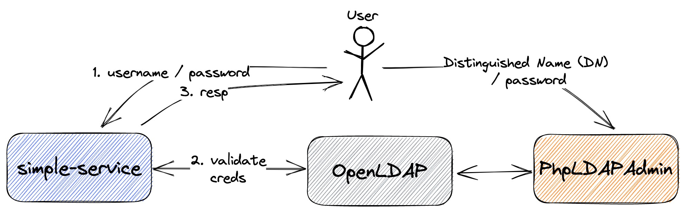
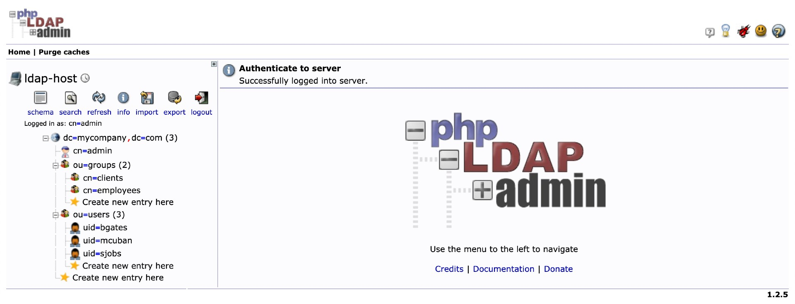
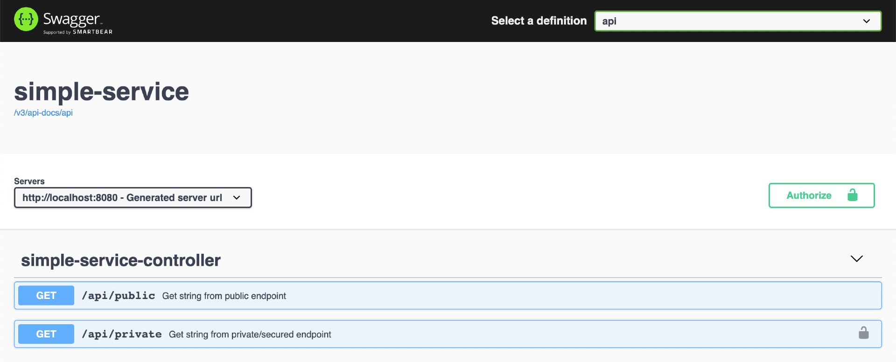

# springboot-ldap-testcontainers

The goal of this project is to create a simple [`Spring Boot`](https://docs.spring.io/spring-boot/docs/current/reference/htmlsingle/) REST API, called `simple-service`, and secure it with `Spring Security LDAP` module. We will use [`Testcontainers`](https://www.testcontainers.org/) for integration testing. 

## Proof-of-Concepts & Articles

On [ivangfr.github.io](https://ivangfr.github.io), I have compiled my Proof-of-Concepts (PoCs) and articles. You can easily search for the technology you are interested in by using the filter. Who knows, perhaps I have already implemented a PoC or written an article about what you are looking for.

## Additional Readings

- \[**Medium**\] [**Implementing and Securing a Simple Spring Boot REST API with LDAP**](https://medium.com/javarevisited/implementing-and-securing-a-simple-spring-boot-rest-api-with-ldap-7279528ef746)
- \[**Medium**\] [**Implementing and Securing a Spring Boot GraphQL API with LDAP**](https://medium.com/javarevisited/implementing-and-securing-a-spring-boot-graphql-api-with-ldap-14fe574225e1)

## Project Diagram



## Application

- ### simple-service

  `Spring Boot` Java Web application that exposes two endpoints:
   - `GET /api/public`: that can be access by anyone, it is not secured;
   - `GET /api/private`: that can just be accessed by users authenticated with valid LDAP credentials.

## Prerequisites

- [`Java 17+`]( https://www.oracle.com/java/technologies/downloads/#java17)
- [`Docker`](https://www.docker.com/)
- [`Docker-Compose`](https://docs.docker.com/compose/install/)

## Start Environment

Open a terminal and inside `springboot-ldap-testcontainers` root folder run
```
docker-compose up -d
```

## Import OpenLDAP Users

The `LDIF` file we will use, `simple-service/src/main/resources/ldap-mycompany-com.ldif`, contains a pre-defined structure for `mycompany.com`. Basically, it has 2 groups (`employees` and `clients`) and 3 users (`Bill Gates`, `Steve Jobs` and `Mark Cuban`). Besides, it's defined that `Bill Gates` and `Steve Jobs` belong to `employees` group and `Mark Cuban` belongs to `clients` group.
```
Bill Gates > username: bgates, password: 123
Steve Jobs > username: sjobs, password: 123
Mark Cuban > username: mcuban, password: 123
```

There are two ways to import those users: by running a script; or by using `phpldapadmin`

### Import users running a script

- In a terminal, make use you are in `springboot-ldap-testcontainers` root folder

- Run the following script
  ```
  ./import-openldap-users.sh
  ```
  
- Check users imported using [`ldapsearch`](https://linux.die.net/man/1/ldapsearch)
  ```
  ldapsearch -x -D "cn=admin,dc=mycompany,dc=com" \
    -w admin -H ldap://localhost:389 \
    -b "ou=users,dc=mycompany,dc=com" \
    -s sub "(uid=*)"
  ```

### Import users using phpldapadmin

- Access https://localhost:6443

- Login with the following credentials
  ```
  Login DN: cn=admin,dc=mycompany,dc=com
  Password: admin
  ```

- Import the file `simple-service/src/main/resources/ldap-mycompany-com.ldif`

- You should see something like

  

## Run application with Maven

- In a terminal, make use you are in `springboot-ldap-testcontainers` root folder

- Run the following command to start `simple-service`
  ```
  ./mvnw clean spring-boot:run --projects simple-service
  ```

## Run application as Docker container

- In a terminal, make sure you are in `springboot-ldap-testcontainers` root folder

- Build Docker Image
  - JVM
    ```
    ./docker-build.sh
    ```
  - Native
    ```
    ./docker-build.sh native
    ```

- Environment Variables

  | Environment Variable | Description                                             |
  |----------------------|---------------------------------------------------------|
  | `LDAP_HOST`          | Specify host of the `LDAP` to use (default `localhost`) |
  | `LDAP_PORT`          | Specify port of the `LDAP` to use (default `389`)       |

- Run Docker Container
  ```
  docker run --rm --name simple-service -p 8080:8080 \
    -e LDAP_HOST=openldap \
    --network springboot-ldap-testcontainers_default \
    ivanfranchin/simple-service:1.0.0
  ```

## Testing using curl

1. Open a terminal

1. Call the endpoint `/api/public`
   ```
   curl -i localhost:8080/api/public
   ```

   It should return
   ```
   HTTP/1.1 200
   It is public.
   ```

1. Try to call the endpoint `/api/private` without credentials
   ```
   curl -i localhost:8080/api/private
   ```
   
   It should return
   ```
   HTTP/1.1 401
   ```

1. Call the endpoint `/api/private` again. This time informing `username` and `password`
   ```
   curl -i -u bgates:123 localhost:8080/api/private
   ```
   
   It should return
   ```
   HTTP/1.1 200
   bgates, it is private.
   ```

1. Call the endpoint `/api/private` informing an invalid password
   ```
   curl -i -u bgates:124 localhost:8080/api/private
   ```
   
   It should return
   ```
   HTTP/1.1 401 
   ```

1. Call the endpoint `/api/private` informing a non-existing user
   ```
   curl -i -u cslim:123 localhost:8080/api/private
   ```
   
   It should return
   ```
   HTTP/1.1 401
   ```

## Testing using Swagger

1. Access http://localhost:8080/swagger-ui.html

   

1. Click `GET /api/public` to open it; then, click `Try it out` button and, finally, `Execute` button.

   It should return
   ```
   Code: 200
   Response Body: It is public.
   ```

1. Click `Authorize` button (green-white one, located at top-right of the page)

1. In the form that opens, provide the `Bill Gates` credentials, i.e, username `bgates` and password `123`. Then, click `Authorize` button, and to finalize, click `Close` button

1. Click `GET /api/private` to open it; then click `Try it out` button and, finally, `Execute` button.

   It should return
   ```
   Code: 200
   Response Body: bgates, it is private.
   ```

## Shutdown

- To stop `simple-service` application, go to the terminal where it is running and press `Ctrl+C`
- To stop and remove docker-compose containers, network and volumes, in a terminal and inside `springboot-ldap-testcontainers` root folder, run the following command
  ```
  docker-compose down -v
  ```

## Running Test Cases

- In a terminal, make sure you are inside `springboot-ldap-testcontainers` root folder

- Run the command below to start the **Unit Tests**
  ```
  ./mvnw clean test --projects simple-service
  ```

- Run the command below to start the **Unit** and **Integration Tests**
  > **Note**: `Testcontainers` will start automatically `OpenLDAP` Docker container before some tests begin and will shut it down when the tests finish.
  ```
  ./mvnw clean verify --projects simple-service
  ```

## Cleanup

To remove the Docker image created by this project, go to a terminal and, inside `springboot-ldap-testcontainers` root folder, run the following script
```
./remove-docker-images.sh
```
