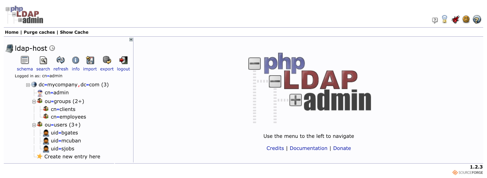
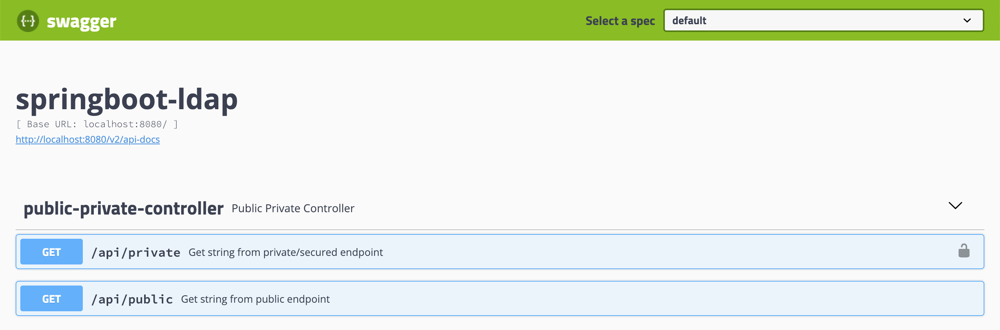

# `springboot-ldap`

The goal of this project is to create a simple [`Spring Boot`](https://docs.spring.io/spring-boot/docs/current/reference/htmlsingle/)
REST API, called `simple-service`, and secure it with `Spring Security LDAP` module.

## Application

### simple-service

`Spring Boot` Java Web application that exposes two endpoints:
- `/api/public`: that can be access by anyone, it is not secured;
- `/api/private`: that can just be accessed by users authenticated with valid LDAP credentials.

## Start Environment

Open a terminal and inside `springboot-ldap` root folder run
```
docker-compose up -d
```

## Import OpenLDAP Users

The `LDIF` file we will use, `springboot-ldap/ldap/ldap-mycompany-com.ldif`, contains already a pre-defined structure
for `mycompany.com`. Basically, it has 2 groups (`employees` and `clients`) and 3 users (`Bill Gates`, `Steve Jobs`
and `Mark Cuban`). Besides, it is defined that `Bill Gates` and `Steve Jobs` belong to `employees` group and
`Mark Cuban` belongs to `clients` group.
```
Bill Gates > username: bgates, password: 123
Steve Jobs > username: sjobs, password: 123
Mark Cuban > username: mcuban, password: 123
```

There are two ways to import those users: by running a script; or by using `phpldapadmin`

### Import users running a script

In `springboot-ldap` root folder run
```
./import-openldap-users.sh
```

### Import users using phpldapadmin



- Access https://localhost:6443

- Login with the following credentials
```
Login DN: cn=admin,dc=mycompany,dc=com
Password: admin
```

- Import the file `springboot-ldap/ldap/ldap-mycompany-com.ldif`

### Check users imported

Run the command below to check the users imported. It uses `ldapsearch`
```
ldapsearch -x -D "cn=admin,dc=mycompany,dc=com" \
  -w admin -H ldap://localhost:389 \
  -b "ou=users,dc=mycompany,dc=com" \
  -s sub "(uid=*)"
```

## Run application

In a terminal and inside `springboot-ldap` root folder, run
```
./mvnw clean spring-boot:run --projects simple-service
```

## Testing using curl

1. Open a terminal

2. Call the endpoint `/api/public`
```
curl -i http://localhost:8080/api/public
```

It will return
```
HTTP/1.1 200
It is public.
```

3. Try to call the endpoint `/api/private` without credentials
``` 
curl -i http://localhost:8080/api/private
```

It will return
```
HTTP/1.1 401
{
  "timestamp": "2018-06-02T22:39:18.534+0000",
  "status": 401,
  "error": "Unauthorized",
  "message": "Unauthorized",
  "path": "/api/private"
}
```

4. Call the endpoint `/api/private` again. This time informing `username` and `password`
``` 
curl -i -u bgates:123 http://localhost:8080/api/private
```

It will return
```
HTTP/1.1 200
bgates, it is private.
```

5. Call the endpoint `/api/private` informing an invalid password
``` 
curl -i -u bgates:124 http://localhost:8080/api/private
```

It will return
```
HTTP/1.1 401 
{
  "timestamp": "2018-06-02T22:42:29.221+0000",
  "status": 401,
  "error": "Unauthorized",
  "message": "Unauthorized",
  "path": "/api/private"
}
```

6. Call the endpoint `/api/private` informing a non-existing user
``` 
curl -i -u cslim:123 http://localhost:8080/api/private
```

It will return
```
HTTP/1.1 401
{
  "timestamp": "2018-06-02T22:44:13.617+0000",
  "status": 401,
  "error": "Unauthorized",
  "message": "Unauthorized",
  "path": "/api/private"
}
```

## Testing using Swagger



1. Access http://localhost:8080/swagger-ui.html

2. Click on `simple-service-controller` to open it.

3. Click on `GET /api/public`, then on `Try it out` button and, finally, on `Execute` button. It will return
```
Code: 200
Response Body: It is public.
```

4. Click on `GET /api/private`, it is a secured endpoint. Then, click on `Try it out` button and, finally, on
`Execute` button. A window will appear to inform the username and password. Type
```
username: bgates
password: 123
```

It will return
```
Code: 200
Response Body: bgates, it is private.
```

## Shutdown

Run the command below to stop and remove containers, networks and volumes
```
docker-compose down -v
```
